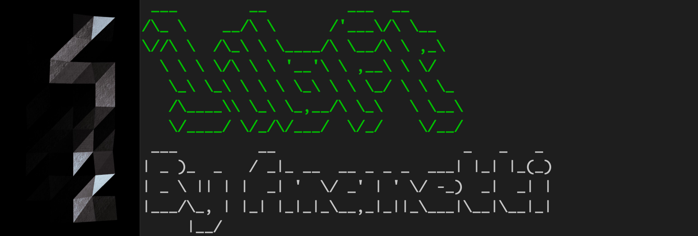

# libft ✅

- 42cursus - 2019-2020
- Author = fmanetti
- Result = 107%
- Closed = 29 / 11 / 2019

## Description

This project is about coding a C library.
It will contain a lot of general purpose functions your programs will rely upon.

## Skills
* Rigor
* Imperative Programming
* Algorithms & AI

## Introduction

C programming can be very tedious when one doesn’t have access to the highly useful
standard functions. This project is about understanding the way these functions work,
implementing and learning to use them. Your will create your own library. It will be
helpful since you will use it in your next C school assignments.

## Libc Functions

- [x] memset
- [x] bzero
- [x] memcpy
- [x] memccpy
- [x] memmove
- [x] memchr
- [x] memcmp
- [x] strlen 
- [x] isalpha 
- [x] isdigit 
- [x] isalnum 
- [x] isascii 
- [x] isprint
- [x] toupper 
- [x] tolower 
- [x] strchr 
- [x] strrchr 
- [x] strncmp 
- [x] strlcpy 
- [x] strlcat 
- [x] strnstr 
- [x] atoi
- [x] calloc 
- [x] strdup

## Additional functions

- [x] ft_substr
- [x] ft_strjoin
- [x] ft_strtrim
- [x] ft_split
- [x] ft_itoa
- [x] ft_strmapi
- [x] ft_putchar_fd
- [x] ft_putstr_fd
- [x] ft_putendl_fd
- [x] ft_putnbr_fd

## Bonus functions

- [x] ft_lstnew
- [x] ft_lstadd_front
- [x] ft_lstsize
- [x] ft_lstlast
- [x] ft_lstadd_back
- [x] ft_lstdelone
- [x] ft_lstclear
- [x] ft_lstiter
- [x] ft_lstmap

## Sources

* [man](https://man7.org/)
